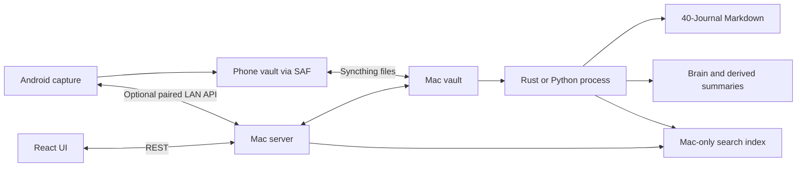

# Chronicle architecture

Chronicle shares a file contract across Android, a Rust desktop/server runtime, and a Python toolchain. The data vault is independent of the source repository. This guide describes source ownership; it is not a claim that every runtime path has been qualified on a physical device.

## Runtime owners

| Component | Entry point | Responsibility |
| --- | --- | --- |
| Android | [MainActivity.kt](../chronicle-android/app/src/main/java/com/chronicle/app/MainActivity.kt) | Compose UI, SAF capture and browsing, optional Mac API access |
| Tauri shell | [lib.rs](../chronicle-pc/desktop/src-tauri/src/lib.rs), [embedded.rs](../chronicle-pc/desktop/src-tauri/src/embedded.rs) | Native windows, tray, capture surface, in-process Rust server lifecycle |
| Rust CLI | [main.rs](../chronicle-pc/server/src/main.rs) | Native serve/process/index/brain and selected maintenance commands |
| Rust transport | [serve.rs](../chronicle-pc/server/src/serve.rs), [api.rs](../chronicle-pc/server/src/api.rs) | API, pairing, loopback HTTP, LAN TLS, frontend asset serving |
| Shared UI | [App.tsx](../chronicle-pc/frontend/src/App.tsx) | Timeline, Notes, Brain, Settings over REST |
| Python CLI | [cli.py](../chronicle-pc/pipeline/chronicle_pipeline/cli.py) | Alternative FastAPI server, watcher, migrations, maintenance |

The shell calls `embedded::boot`; that path prepares and runs `chronicle_server::serve` on the Tauri async runtime. There is no Python sidecar in this path. The shell still discovers the PC checkout and the server serves the shared UI from disk. The shell's own `desktop/dist/` is not the same build as `frontend/dist/`.

## Capture, filing, and retrieval

1. Capture clients write structured entry JSON under `_capture/entries/yyyy/MM/` and media under `_attachments/`.
2. Processing fills available transcripts/captions, files prose into entry-specific Markdown fences, updates state, and refreshes derived knowledge.
3. Structured fields remain in entry JSON. Once filed, journal prose lives in `40-Journal/YYYY-MM-DD.md`.
4. Journal amendments use content hashes to detect changed blocks. Conflicts need an explicit resolution; local atomic writes and locks do not create a distributed transaction across Syncthing peers.
5. Brain curation intent is appended to `curation/ops/<device>.jsonl`. The generated graph lives at `brain/graph.json`; it is not itself an append-only log.
6. Search uses a Mac-only index, local Ollama embeddings, and keyword retrieval. Source references should remain visible when presenting recall results.

## Vault ownership

| Path | Meaning | Sync / editing |
| --- | --- | --- |
| `_capture/entries/` | Entry metadata and processing state | Synced; client edits restricted after processing |
| `_attachments/` | Capture media | Synced |
| `40-Journal/` | Filed prose | Synced; preserve fences and use conflict-aware amends |
| `00-Inbox/` | Unsorted knowledge notes | Synced, editable |
| `10-Work/` | Work, projects, people, ResumePoints | Synced, editable |
| `20-Personal/` | Personal notes and responsibilities | Synced, editable |
| `30-Knowledge/` | Evergreen knowledge and reference | Synced, editable |
| `90-Archive/` | Archived knowledge | Synced, editable |
| `brain/` | Graph, enrichment, tags, insights | Mac-generated, synced for reading |
| `_system/derived/` | Regenerable aggregates | Mac-generated, synced |
| `curation/ops/` | Per-device graph-edit intent | Synced, append-only |
| `index/` | Search database and server discovery | Mac-only, excluded from sync |
| `config.json` | Vault version, timezone, model/provider configuration | PC-owned; never put credentials here |

`40-Journal/` is a journal, not a generic PARA knowledge area. `kb/files/` and `kb/knowledge.json` retain specific reference/profile roles; `kb/notes/` is retired. The archived `KnowledgeBase/` product and the generic vault setup prompt are not alternate live implementations.

## Data and network boundaries

- **Folder sync:** Syncthing moves files. A paired API session, entry mirror, or SSE update is not a complete folder-sync receipt.
- **LAN:** Rust serves loopback HTTP for the local UI and pinned TLS on the LAN address. Pairing tokens persist per device and can be revoked. Loopback trust does not make a local process harmless.
- **Cloud:** Ollama is the default provider. Grok is wired in both Mac runtimes. Vertex is Python-only: a Rust adapter file exists, but the active provider factory rejects it. Android has Grok. Text cloud consent and vision cloud consent are distinct. Model/provider availability is a runtime dependency.
- **Secrets:** Mac credentials live outside the vault, including `~/.config/chronicle/secrets.json`; this is a local file, not an OS keychain. Android stores cloud settings through protected preferences. Synced configuration can influence provider choices, so trust of sync peers still matters.
- **Encryption:** `text_enc` is optional entry-text encryption. Do not advertise whole-vault encryption: Markdown journals, attachments, and all derived files are not covered merely by enabling it. Locking and index purge behavior is specified in the shared contract and tested separately.
- **Offline:** Capture and already-synced browsing do not require a Mac connection. Full-vault phone recall needs a reachable Mac; local AI requires downloaded models and the appropriate runtime.

No security behavior is changed by this documentation update. [SECURITY.md](../SECURITY.md) defines the review boundaries; [CONTRACT.md](../chronicle-pc/CONTRACT.md) defines the detailed wire formats.

## Compatibility and evidence

Contract **v1.11** includes pairing, events, entry mirrors, and entry-text encryption. Vault **layout_version 2** is the file-once layout. Equal contract files do not prove complete Rust/Python behavioral parity: their command surfaces differ, and any parity claim needs an assertion-backed comparison.

**Verified by source inspection:** the runtime owners and paths linked above. **Unverified by that inspection:** successful model calls, physical Android capture/sync, packaged installation, TLS on a real LAN, and full runtime parity. See [development checks](DEVELOPMENT.md).
