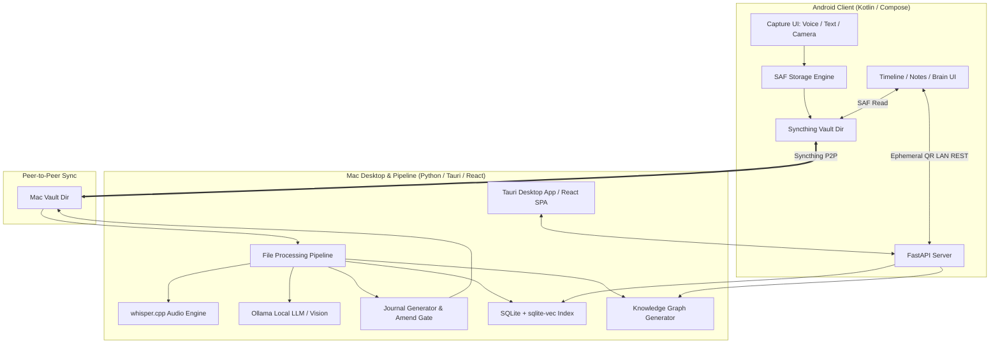

# Portfolio Showcase: Chronicle
**A Local-First, Shared Cross-Device "Second Brain" System with On-Device RAG & Knowledge Graph**

---

## Executive Summary

**Chronicle** is a production-grade, local-first personal knowledge management and journal system engineered across **macOS (Python/FastAPI, React SPA, Tauri)** and **Android (Kotlin, Jetpack Compose, Storage Access Framework)**. 

Designed with a strict privacy-first philosophy (*"Phone captures, Mac thinks, Syncthing syncs"*), Chronicle eliminates proprietary cloud vendor lock-in, centralized servers, and product telemetry. It features an automated local AI processing pipeline using **Ollama** (35B LLM, 11B Vision, 768-dim Embeddings), **whisper.cpp** for local audio transcription, hybrid **SQLite-vec RAG**, an append-only Knowledge Graph with temporal archiving, and a dual-source-of-truth file-once Markdown journal engine.

---

## Key Highlights & Performance Indicators

- **100% Local-First & Zero Telemetry**: Operates completely offline with zero mandatory cloud dependencies. Optional cloud LLMs (Grok / GCP Vertex AI) are strictly opt-in with zero-key-leakage architecture.
- **Cross-Platform Synchronization**: Seamless peer-to-peer syncing using Syncthing without custom synchronization servers or database lock-in.
- **Executable Shared Contract**: Strict, byte-identical JSON Schema data contract enforcing cross-app data compatibility between Kotlin (Android) and Python (macOS).
- **Hybrid Search & RAG**: Vector similarity search via `sqlite-vec` (`nomic-embed-text`) paired with BM25 full-text keyword indexing and graph-seeded retrieval.
- **Self-Healing Data Engine**: Built-in AST/MD parsing and optimistic concurrency control (`filed_content_hash`) preventing data corruption or overwrite races across devices.

---

## System Architecture

---

## Key Engineering Innovations & Architectural Decisions

### 1. Dual Source-of-Truth & Hash-Gated Amend System
* **Problem**: Storing metadata in JSON and journal prose in Markdown often leads to sync conflicts, corrupted user edits, or loss of entry provenance.
* **Solution**: Implemented a **File-Once Journal State Machine**. Raw entry capture provenance (timestamps, tags, mood, attachments) is immutably stored in JSON under `_capture/entries/`. The pipeline processes raw captures into human-friendly Markdown daily journals (`40-Journal/YYYY-MM-DD.md`) wrapped in unique comment fences (`<!-- entry:<id> -->`).
* **Optimistic Locking**: Every fenced block tracks a SHA-256 `filed_content_hash`. Pipeline re-renders or user amends via API enforce exact hash verification (`base_hash == filed_content_hash`), throwing HTTP 409 conflicts if external edits (e.g., via Obsidian) occurred, guaranteeing user prose is never silently overwritten.

### 2. Cross-Language Executable Data Contract
* **Problem**: Maintaining data schema parity across mobile (Kotlin) and backend/desktop (Python) during fast-paced feature development.
* **Solution**: Authored a unified, byte-identical contract (`CONTRACT.md` + `contract/*.schema.json`) shared across repositories. Both platforms validate vault reads and writes against these executable schemas, failing fast with explicit error codes (`layout_version: 2`) rather than allowing silent data degradation.

### 3. Local-First RAG & Graph-Augmented Retrieval
* **Problem**: Traditional RAG systems rely on expensive third-party vector databases and cloud APIs, exposing sensitive personal journals to external servers.
* **Solution**: Developed a dual RAG retrieval system using local **Ollama** embeddings (`nomic-embed-text` @ 768 dimensions) indexed in **SQLite-vec**. Augmented vector retrieval with an explicit **Knowledge Graph (`brain/graph.json`)** connecting entry nodes, topics, concepts, and PARA categories. Older entry nodes are automatically sharded into yearly archives (`brain/graph-archive/yyyy.json`) for O(1) active graph memory usage.

### 4. Zero-Trust Local Security & Private LAN Pairing
* **Problem**: Allowing the mobile app to query the local Mac AI pipeline without hardcoding network secrets or exposing unauthenticated local ports.
* **Solution**: Implemented zero-trust LAN pairing. Non-loopback REST calls require an ephemeral `X-Chronicle-Token` header. Pairing tokens are transferred strictly via local terminal QR codes or loopback-only Settings APIs. Secrets and BYOK cloud keys (Grok, GCP Vertex) are segregated into system keychain stores (`~/.config/chronicle/secrets.json` or Android `EncryptedSharedPreferences`) and are never written to the synced vault.

### 5. Storage Access Framework (SAF) & POSIX Atomic I/O
* **Problem**: Mobile OS file permissions and P2P file sync can cause partial file reads and broken media state during active writes.
* **Solution**: Implemented atomic file operations using write-to-temp-then-rename patterns on both platforms (POSIX rename on macOS; SAF `renameDocument` on Android). 

---

## Tech Stack Breakdown

| Layer | Technologies Used | Key Concepts & Patterns |
|---|---|---|
| **Android Mobile** | Kotlin, Jetpack Compose, Material 3, SAF, Coroutines/Flow, Health Connect | Single-Activity Architecture, SAF (Storage Access Framework), EncryptedSharedPreferences, Offline-first, Network Security Config |
| **Mac Desktop & Frontend** | React 18, Vite, TypeScript, TailwindCSS / CSS Modules, Tauri (Rust shell) | Single Page Application (SPA), REST Client, State Management, Cross-platform Desktop Packaging |
| **Backend & Pipeline** | Python 3.11+, FastAPI, Pydantic v2, Typer CLI, Pytest | Async REST API, File Watcher (Watchdog), CLI Tooling, Dependency Injection, Schema Validation |
| **AI / Machine Learning** | Ollama (Ornith 35B / Llama 3.1 8B, Llama 3.2 Vision), whisper.cpp, `nomic-embed-text` | On-Device Quantized LLM Inference, C++ Audio Processing, Multimodal Vision Prompting, Context Window Optimization |
| **Storage & RAG** | SQLite 3, `sqlite-vec`, JSON Schema, Markdown (CommonMark), Syncthing P2P | Vector Cosine Similarity Search, BM25 Keyword Search, Graph Network Sharding, Event-Driven File Sync |

---

## Portfolio & Resume Highlights

### Resume Bullet Points (Tailored for Senior / Lead Engineers)

#### Full-Stack / Software Engineer
- **Engineered** a local-first, cross-platform personal knowledge system (*Chronicle*) across macOS (Python/FastAPI, React SPA, Tauri) and Android (Kotlin, Jetpack Compose), facilitating zero-latency offline note capture and AI processing.
- **Designed** a resilient dual source-of-truth storage engine using JSON provenance files and SHA-256 hash-gated Markdown fences, eliminating sync race conditions and preventing silent data corruption across P2P nodes.
- **Architected** an executable cross-platform data contract (`contract/*.schema.json`), enforcing byte-level schema parity and migration gates across Kotlin and Python codebases.

#### AI / Systems / Platform Engineer
- **Built** an on-device local RAG system leveraging **Ollama** (`nomic-embed-text`), **SQLite-vec**, and **whisper.cpp**, achieving hybrid vector/keyword search and audio transcription with 100% offline privacy.
- **Implemented** a temporal Knowledge Graph engine (`brain/graph.json`) with automated entity/concept extraction and sliding-window historical node archiving to keep graph traversal performant over multi-year datasets.
- **Developed** a zero-trust LAN pairing protocol using ephemeral QR tokens (`X-Chronicle-Token`) and platform keychains, securing mobile-to-desktop AI endpoints without exposing API credentials to file sync channels.

---

## Portfolio Presentation Template (Markdown / Notion / Readme)

### Project Overview
> **Chronicle** is a privacy-centric, local-first "shared second brain" application. It connects phone audio/text/photo captures with a powerful desktop AI pipeline over peer-to-peer file synchronization (Syncthing).

### Architecture Highlights
- **Phone Captures**: Native Android app written in Kotlin & Jetpack Compose using Storage Access Framework (SAF) to write immutable entry provenance directly into a Syncthing folder.
- **Mac Thinks**: Python/FastAPI pipeline automatically transcribes voice notes via `whisper.cpp`, summarizes text using local Ollama LLMs (35B), embeds vectors with `nomic-embed-text`, and generates structured Markdown journals.
- **Local RAG & Brain Graph**: RAG queries run locally against a combined SQLite-vec vector index and a sharded Knowledge Graph, accessible via a responsive React SPA wrapped in Tauri.

### Key Engineering Wins
1. **Zero Vendor Lock-In**: Plain JSON + Markdown files openable directly in Obsidian or VS Code.
2. **Deterministic Data Integrity**: Strict hash validation prevents pipeline background jobs from overwriting human edits.
3. **Privacy by Design**: Zero phone-home telemetry; cloud API keys kept strictly outside synced folders.

---

## Interview Deep-Dive Guide (Talking Points & Technical Questions)

### Q1: Why use Syncthing and flat files instead of SQLite / Postgres or a Cloud Database?
**Answer**: 
- *User Privacy & Longevity*: Personal journals need to last decades without relying on SaaS backends or proprietary database formats. Plain Markdown and JSON guarantee future-proof readability.
- *Local-First Decoupling*: By leveraging Syncthing for file replication, the applications don't need complex synchronization servers or distributed database drivers. Each client reads and writes local files atomically.

### Q2: How do you handle concurrent edits between Android SAF writes and Mac pipeline processing?
**Answer**: 
- We enforced a **File-Once State Machine** and an **Amend Gate**.
- The Android app only creates raw capture entries (`_capture/entries/`) and never modifies processed journal files (`40-Journal/`).
- When the Mac pipeline files an entry into Markdown, it records a SHA-256 `filed_content_hash`. Any subsequent user edit in the frontend or Obsidian alters the block hash. If the user attempts an API update, the server checks `base_hash == on_disk_hash == filed_content_hash`. If any mismatch occurs, it throws an optimistic concurrency error (`HTTP 409 Conflict`), requiring explicit resolution instead of silently overwriting user prose.

### Q3: How does the RAG system handle context scaling as the vault grows over years?
**Answer**: 
- We split vector search and graph search into tiered structures.
- **Vector Search**: Embeddings (`768-dim`) are indexed in `sqlite-vec` on the Mac.
- **Knowledge Graph**: The active `graph.json` contains full topic, entity, and concept nodes, but caps active `entry` nodes to the most recent 12 months. Historical entry nodes are automatically archived into yearly files (`graph-archive/yyyy.json`) and loaded on-demand during deep historical recall queries.

---
